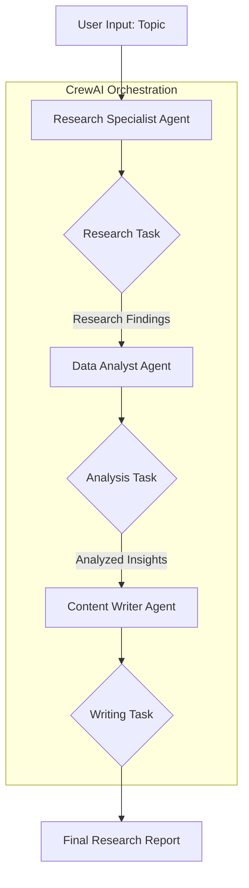

# 📌 AI Research Assistant with CrewAI

A multi-agent AI research assistant built with CrewAI and Streamlit, designed to autonomously research topics, analyze data, and generate high-quality reports.

## 🔍 Features

- **🧠 Multi-Agent System using CrewAI:**
    - **Research Specialist:** Gathers comprehensive information from multiple online sources.
    - **Data Analyst:** Processes, filters, and analyzes research findings to identify key insights.
    - **Content Writer:** Synthesizes the analysis into a structured and professional final report.
- **📝 Automated Research Workflow:** A seamless pipeline from a single topic input to a complete final report.
- **🌐 Streamlit Frontend:** An intuitive web interface for triggering research and viewing results.
- **🔑 Environment-Based Configuration:** Flexible LLM and API key management via `.env`.
- **📄 Exportable Reports:** Research findings, analysis, and final reports are available in Markdown format.

## 🛠 Tech Stack

- **CrewAI** – Multi-agent orchestration and task management
- **LiteLLM / Groq** – High-performance LLM backend
- **Streamlit** – Web application framework
- **Python 3.10+** – Programming language
- **Serper.dev** – Search API for real-time web research
- **python-dotenv** – Environment variable management

## 📂 Project Structure

```text
.
├── agents/                 # Agent definitions
│   ├── content_writer.py   # Content Writer agent configuration
│   ├── data_analyst.py     # Data Analyst agent configuration
│   └── research_specialist.py # Research Specialist agent configuration
├── tasks/                  # Task definitions
│   ├── analysis_task.py    # Data analysis and insight extraction task
│   ├── research_task.py    # Information gathering task
│   └── writing_task.py     # Final report synthesis task
├── app.py                  # Streamlit web application (UI)
├── crew.py                 # Crew orchestration (connects agents & tasks)
├── main.py                 # CLI entry point for running research
├── requirements.txt        # Project dependencies
└── .env                    # API keys and LLM configurations (not tracked by git)
```

## ⚙️ Workflow

The project follows a sequential pipeline where each agent's output becomes the input for the next.



## 🚀 Getting Started

### 1️⃣ Clone the repository
```bash
git clone https://github.com/your-username/ai-research-assistant.git
cd ai-research-assistant
```

### 2️⃣ Install dependencies
```bash
pip install -r requirements.txt
```

### 3️⃣ Configure Environment Variables
Create a `.env` file in the project root:
```env
SERPER_API_KEY=your_serper_api_key
GROQ_API_KEY=your_groq_api_key
RESEARCH_AGENT_LLM=llama-3.3-70b-versatile
RESEARCH_AGENT_TEMPERATURE=0.3
# Add other agent LLM configs as needed
```

### 4️⃣ Run the Application

**Via Web Interface (Streamlit):**
```bash
streamlit run app.py
```

**Via Command Line:**
```bash
python main.py
```

## 📝 Usage

1. **Enter a research topic** in the Streamlit input box (e.g., "The impact of Quantum Computing on Cybersecurity").
2. **Click "Start Research"**.
3. **Monitor Progress:** The agents will autonomously:
    - 🔍 Gather real-time web data.
    - 📊 Analyze and structure the information.
    - ✍️ Draft a comprehensive report.
4. **Review Results:** Switch between tabs to view **Research Findings**, **Analysis Report**, and the **Final Report**.
